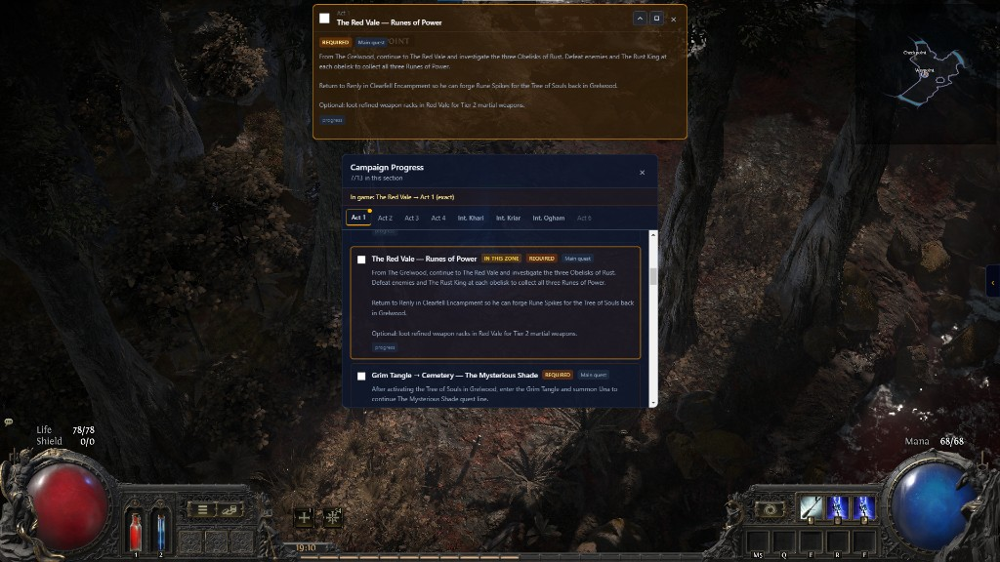
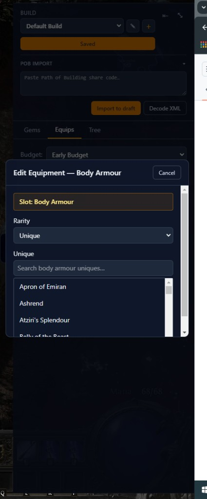
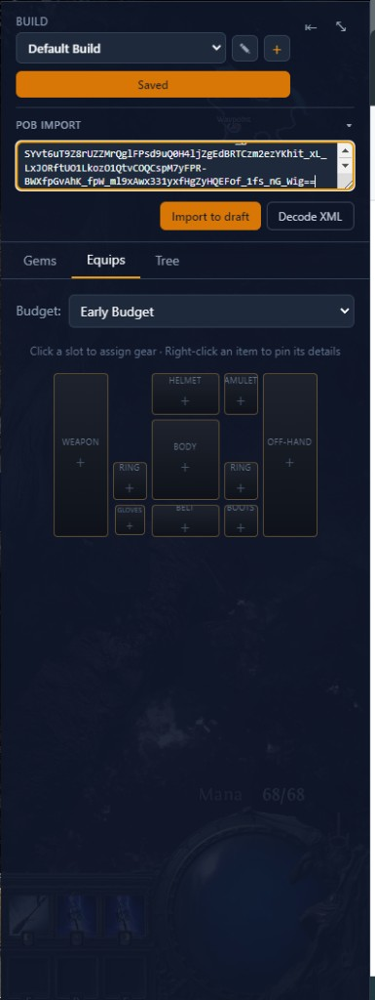
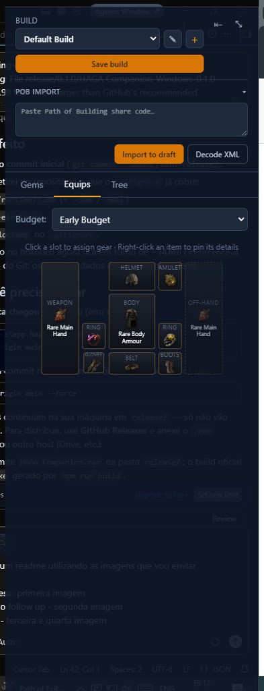
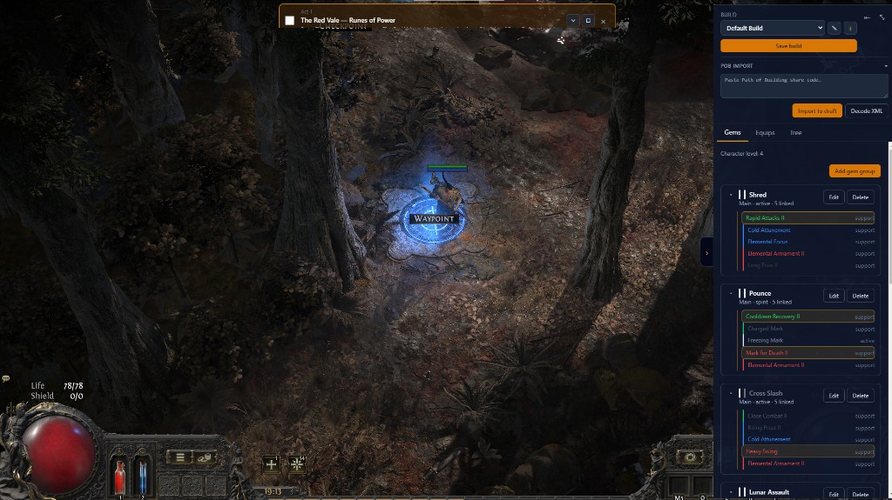
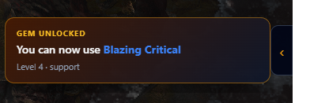

# HAGA Companion

External companion overlay for **Path of Exile 2** — campaign guidance, build planning, gems, and gear reference while you play.



> **Disclaimer:** This product isn't affiliated with or endorsed by Grinding Gear Games in any way.

---

## Download

The first public release is available on GitHub:

**[HAGA Companion 0.1.0](https://github.com/felipegomesflg/haga.companion/releases/tag/0.1.0)** (Windows)

1. Open the release page and download **`haga-companion.rar`**.
2. Extract the archive to a folder on your PC (for example, `C:\Games\HAGA Companion\`).
3. Run **`HAGA Companion.exe`** inside the extracted folder to launch the app.

Newer versions will be published on the [Releases](https://github.com/felipegomesflg/haga.companion/releases) page when available.

---

## Account safety

HAGA Companion is built as a **standalone application** that runs **alongside** Path of Exile 2. It is designed to follow Grinding Gear Games’ third-party requirements:

- **No game client injection**
- **No game memory access**
- **No gameplay automation** (one user action → one result; no macros or chained inputs)
- **No modification of game files**

We align our design with GGG’s published policy for third-party software:

**[Path of Exile — Developer Docs: API Policies and Third-Party Requirements](https://www.pathofexile.com/developer/docs/index#policy)**

GGG does not approve or endorse specific tools. Policies may change; use third-party software at your own discretion. HAGA Companion does not request your PoE account credentials.

---

## Campaign progress


Track story objectives by act and interlude. The overlay highlights what matters **in your current zone**, keeps a compact **HUD** on screen, and marks required steps vs optional power upgrades.

---

## Editable gear slots



Assign items slot by slot inside the overlay. Search uniques, pick a budget tier, and pin item details for quick comparison while you play.

---

## Import via Path of Building

Paste a Path of Building share code to load a draft build, then tweak it in the overlay.





Use **Import to draft**, review **Gems**, **Equips**, and **Tree**, then **Save build**.

---

## Gems — from POB or edited in-app



Manage skill groups in the overlay. Gems you can use at your current level are highlighted; the rest stay visible as a checklist for later levels.

---

## Gem unlock notification



When you reach a level that unlocks a gem from your build, a small **GEM UNLOCKED** toast appears and the gem is highlighted in the panel.

---

## Settings

Open **Settings** from the configurable hotkey.

| Area | What you can change |
|------|---------------------|
| **Language** | English or Português (Brasil) for the companion UI |
| **Shortcuts** | Toggle build panel, campaign panel, HUD, click-through, settings |
| **Builds** | Switch active build, **export** / **import** HAGA share codes |
| **Multiple builds** | Create, rename, and save separate builds from the build panel (selector + **Save build**) |

Restart the app after changing hotkeys so they take effect.

---

## Install (developers)

For end users, use the **[Download](#download)** section above. Developers can build a local installer with `npm run build` (output under `release/`).

---

## Development

```bash
npm install
npm run seed:data
npm run dev
```

```bash
npm run build   # Windows installer → release/
```

---

## License

Proprietary — **FELGOM LTDA**.
